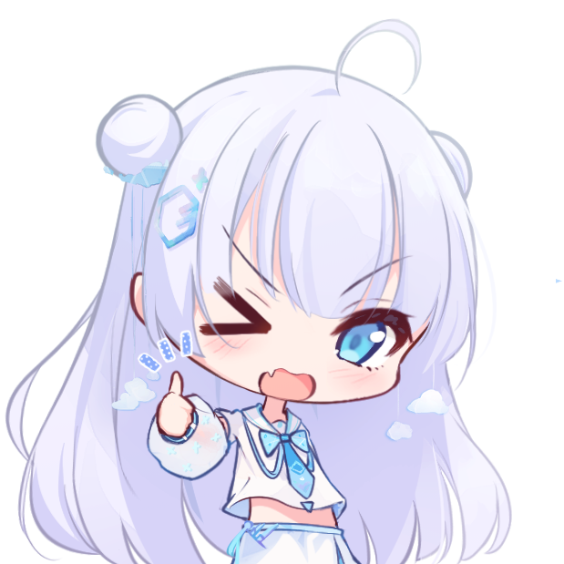
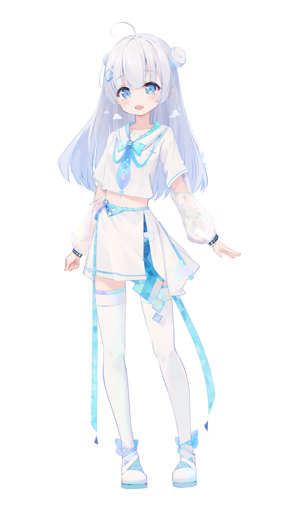

<a href="./set.md">☁️ 小云设定集大公开！</a>

> 还有什么其他需要补充的，可以去 [Discussions](https://github.com/YunYouJun/yun/discussions) 提醒我更新。

- [小云的偶像之路｜语雀知识库](https://www.yuque.com/yunyoujun/vtb)
- TG 贴纸包：[小云包](https://t.me/addstickers/xiao_yun)

## 📺相关视频📺

- Bilibili：[云游君](https://space.bilibili.com/1579790)
  - 直播间：[yyj.moe/live](https://yyj.moe/live)
- [视频相关记录](./videos/README.MD)

## 人物设定

> 小云人设画师：[Ai_Floverse](https://twitter.com/Ai_Floverse)

见 [./set.md](./set.md)。

## 图片说明

- `images`: 图片相关内容
  - `meme`: 表情包文件夹

### 图片链接

- jsDelivr CDN: <https://cdn.jsdelivr.net/gh/YunYouJun/yun>

> Example: <https://cdn.jsdelivr.net/gh/YunYouJun/yun/images/yun-alpha.png>

## 版权说明

遵循 [CC BY-NC-SA 4.0](https://creativecommons.org/licenses/by-nc-sa/4.0/deed.zh) 协议。

---

简而言之，在非商业使用与署名（发布时注明原设出处即可）的前提下，您可以任意对其进行修改（包括但不限于 P 图、二次创作）、印刷、分发等。

**如果你觉得你制作的小云表情包很可爱，就来给本仓库创建 [PR](https://github.com/YunYouJun/yun/pulls) 吧！**（等之后如果印钥匙扣、贴纸什么的时候会免费赠送一份！）

## 提交说明

如果你有兴趣提交小云二创，可以看[这里](./images/README.md)！

> 原创类型图片可参考[提交说明](#提交说明)，P 图等（接头行为）可在这里投稿：[小云之接头霸王](https://www.yuque.com/yunyoujun/vtb/meme)。

## 最后

如果您觉得小云很可爱，欢迎给小云[打钱](https://sponsors.yunyoujun.cn/)！
