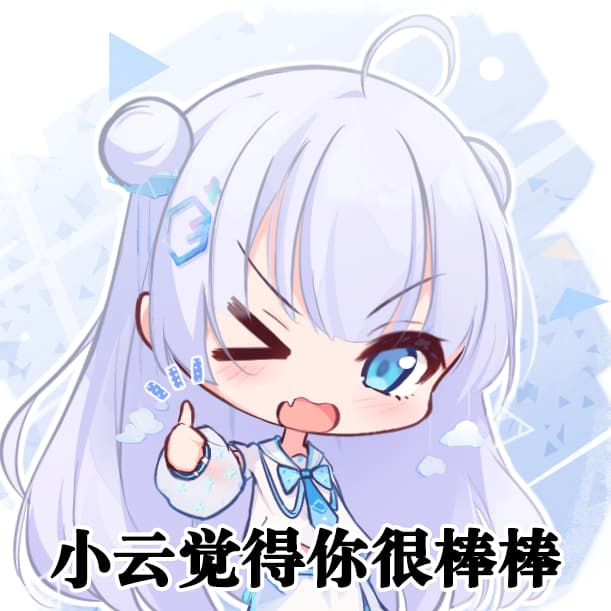

  

<a href="./set.md">☁️ 小云设定集大公开！</a>

> 还有什么其他需要补充的，可以去 [Discussions](https://github.com/YunYouJun/yun/discussions) 提醒我更新。

## 人物设定

见 [./set.md](./set.md)。

## 图片说明

- `images`: 图片相关内容

  - `meme`: 表情包文件夹

### 图片链接

- jsDelivr CDN: <https://cdn.jsdelivr.net/gh/YunYouJun/yun>

> Example: <https://cdn.jsdelivr.net/gh/YunYouJun/yun/images/yun-alpha.png>

## 版权说明

遵循 [CC BY-NC-SA 4.0](https://creativecommons.org/licenses/by-nc-sa/4.0/deed.zh) 协议。

您可以自由地：

- 共享 — 在任何媒介以任何形式复制、发行本作品
- 演绎 — 修改、转换或以本作品为基础进行创作

您需遵守以下条件：

- 署名 — 您必须给出适当的署名，提供指向本许可协议的链接，同时标明是否（对原始作品）作了修改。您可以用任何合理的方式来署名，但是不得以任何方式暗示许可人为您或您的使用背书。
- 非商业性使用 — 您不得将本作品用于商业目的。
- 相同方式共享 — 如果您再混合、转换或者基于本作品进行创作，您必须基于与原先许可协议相同的许可协议分发您贡献的作品。

---

简而言之，在非商业使用与署名（发布时注明原设出处即可）的前提下，您可以任意对其进行修改（包括但不限于 P 图、二次创作）、印刷、分发等。

**如果你觉得你制作的小云表情包很可爱，就来给本仓库创建 [PR](https://github.com/YunYouJun/yun/pulls) 吧！**

> 等之后如果印钥匙扣、贴纸什么的时候会免费赠送一份！

## 提交说明

命名规则：`yun-表情包动作说明`，透明背景：`yun-alpha-表情包动作说明`

如带有 alpha 通道（透明背景），请提交 PNG 格式。
普通预览图，请提交 JPG 格式。并在保证清晰度的同时，对其进行压缩。

> （如果您愿意，您还可以提交 PSD 等源文件的云盘链接。）

- PNG 建议使用 [tinypng](https://tinypng.com/) 压缩。
- JPG 建议使用 [Squoosh](https://squoosh.app/) 压缩。

如希望对表情包附加说明和作者信息，可在 [`images/meme/README.md`](./images/meme/README.md) 中添加描述。

## 最后

如果您觉得小云很可爱，欢迎给小云[打钱](https://sponsors.yunyoujun.cn/)！
